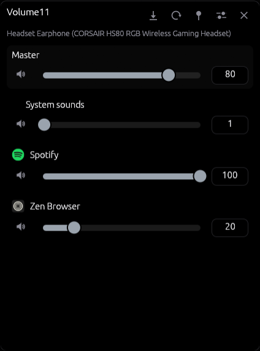
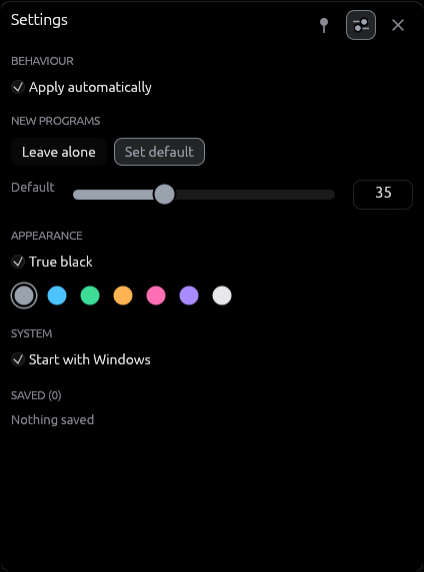

# Volume11

Per-application volume for Windows 11, from the notification area.

Windows forgets. Volume11 stores a level per program and sets it again when that
program starts playing.

<br clear="left">




## Features

- Levels stored per executable, kept across restarts and updates
- Applied automatically when a program starts playing
- Follows the default output device
- Event driven, no polling
- Application icons read from the executables
- True-black theme, seven accents
- Autostart, switchable from Task Manager
- Closing the window keeps it running in the tray
- One instance at a time

## Install

Download `Volume11-Setup.exe` from the
[latest release](https://github.com/baba537/Volume11/releases/latest) and run it.

Installs per user under `%LOCALAPPDATA%\Programs\Volume11`, no administrator
rights. Running the setup elevated installs to Program Files instead. A new
release installs over an older one and keeps its settings. Uninstall through
Windows Settings removes the program, shortcuts and autostart entry; it asks
before deleting saved volumes.

`Volume11.exe` is attached to the release as well, for a portable copy.

The build is not code-signed, so SmartScreen warns once.

## Using it

| Action | How |
|---|---|
| Open or close | Left-click the tray icon |
| Menu | Right-click the tray icon |
| Save current levels | Save button |
| Apply saved levels | Apply button |
| Move the window | Drag the empty part of the header |
| Keep it on top | Pin button |
| Hide | `Esc`, ✕, or Alt+F4 |
| Quit | Tray menu → Quit |

Closing only hides. The window opens at the bottom right of the primary
monitor, above the taskbar, whatever its resolution or scaling. Dragging moves
it for now; the next open puts it back.

Flags:

- `--show` opens the mixer immediately
- `VOLUME11_CONFIG=<path>` for a portable configuration file

## Configuration

`%APPDATA%\Volume11\config.json`:

```json
{
  "version": 1,
  "settings": {
    "auto_apply": true,
    "unknown_app_policy": "leave_alone",
    "default_volume": 50,
    "always_on_top": false,
    "start_with_windows": false,
    "accent": "#9AA3AD",
    "oled_black": true
  },
  "apps": {
    "spotify.exe": { "volume": 45, "muted": false, "label": "Spotify" }
  }
}
```

`unknown_app_policy`: `leave_alone` or `apply_default`.

Autostart lives in the registry, not here, so Task Manager and Volume11 agree on
it. Switching it off marks the entry disabled instead of deleting it, which is
why it stays listed under Startup.

Written atomically. An unreadable file is moved to `config.json.broken`.

## Offline

Volume11 makes no network connections: no networking dependency, no network
code, and the binary imports no networking library. To check:

```bash
cargo tree | grep -iE "reqwest|hyper|ureq|curl|tokio|rustls|openssl"   # no matches
```

```powershell
dumpbin /dependents Volume11.exe    # no ws2_32, winhttp, wininet or urlmon
```

The `https://` strings in the binary are panic and documentation text from egui
and wgpu; there is no HTTP client to fetch them. The libraries loaded at run
time are Windows' own graphics and shell components (`d3d12.dll`, `dxgi.dll`,
`d3dcompiler_47.dll`, `shcore.dll`).

## Building

```bash
cargo build --release
cargo test
cargo run --example smoke        # prints live audio sessions
python tools/make-icon.py        # regenerates assets/icon.ico
```

The installer needs [Inno Setup](https://jrsoftware.org/isinfo.php):

```bash
ISCC.exe /DAppVersion=0.1.0 installer/volume11.iss
```

Releases are built with MSVC; the GNU toolchain works too.

## How it works

| Module | Responsibility |
|---|---|
| `src/audio/engine.rs` | Owns the COM objects on one thread, caches sessions by process id |
| `src/audio/callbacks.rs` | WASAPI callbacks, push into a channel and return |
| `src/audio/process.rs` | Process id to executable name and label |
| `src/config.rs` | JSON, atomic writes |
| `src/tray.rs` | Tray icon and menu, own Win32 message loop |
| `src/instance.rs` | Single instance, and the installer's quit request |
| `src/autostart.rs` | `Run` key plus Task Manager status byte |
| `src/ui/` | Window, theme, slider, icons |
| `src/ui/placement.rs` | Primary monitor work area and taskbar geometry |

The UI thread never touches COM. It sends commands and receives events over
channels. egui runs reactively, so an idle Volume11 draws nothing.

Rendering goes through `wgpu` on Direct3D 12. Windows ships no OpenGL past 1.1;
everything above comes from the GPU driver, so a machine on the Basic Display
Adapter has none. D3D12 is a Windows API with a software fallback and better
maintained drivers.

## History

A rewrite. The original was .NET 9 WPF with NAudio and EF Core/SQLite: 201 MB
plus six DLLs, and a one-minute timer that re-enumerated every audio session.

## License

MIT, see [LICENSE](LICENSE).

Parts of this project were created with AI assistance.
